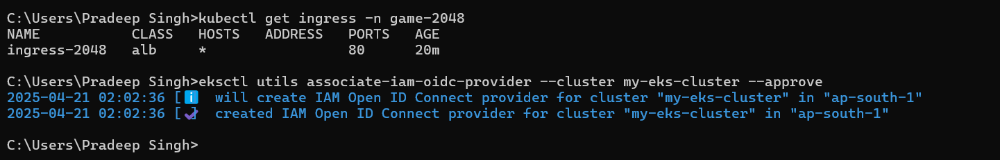

# Kubernetes End-to-End Project on EKS

Kubernetes End-to-End project using **Amazon EKS** — from cluster creation to application deployment with **Ingress**.

---

## What is EKS?

Amazon **EKS (Elastic Kubernetes Service)** is a **managed Kubernetes service** by AWS that handles the Kubernetes control plane so you can focus on your worker nodes and applications.

---

## Traditional Kubernetes Installation Tools

### Tools:
- **Kubeadm**
- **KOPS (Kubernetes Operations)**

### Challenges with KOPS:
- Master node may crash
- Certificate expiration
- API server downtime
- ETCD failure
- Scheduler not functioning

⚠️ Debugging such issues manually takes time and can become highly complex.

---

## Why EKS is Better?

AWS offers a **fully managed control plane** with EKS:

- AWS manages the **Control Plane**
- You manage the **Data Plane (Worker Nodes)**

### Worker Node Options:
1. **EC2 instances**
2. **AWS Fargate** (Serverless compute)

✅ **AWS + Fargate = Highly stable Kubernetes Cluster**

---

## Ways to Run Kubernetes

```text
1. KOPS / Kubeadm on EC2 (Manual Setup)
2. Amazon EKS (Managed)
3. On-prem Kubernetes installation
```

---

## Project Agenda

### ✅ Step-by-Step

1. **Create EKS Cluster**
2. **Deploy Application using Pods/Deployments**
3. **Expose Application using Services (ClusterIP / NodePort / LoadBalancer)**
4. **Introduce Ingress for Efficient Routing**
5. **Implement Ingress Controller with ALB**

---

## Networking Flow Diagram

```mermaid
graph TD
    A[User Request] --> B[Public Subnet (VPC)]
    B --> C[Load Balancer]
    C --> D[Ingress Controller]
    D --> E[Ingress Resource]
    E --> F[Service (ClusterIP)]
    F --> G[Application Pod in Private Subnet]
```

---

## Ingress: Smart Routing

Using **Ingress**, we route traffic efficiently inside the cluster.

### Traditional LoadBalancer Path:
```
User → VPC → LoadBalancer → EIP → Pod (Expensive)
```

### Ingress Path:
```
User → Public Subnet → Ingress Controller (ALB) → Ingress Resource → Service → Pod
```

### Ingress Controller:
- Listens for **Ingress Resources**
- Creates **ALB**
- Allows multiple routes over a single LoadBalancer


---
# pre-requisites

## CLI Tools Installation Guide

### 🔧 kubectl (Kubernetes CLI)
   kubectl --A command line tool for working with Kubernetes clusters.

#### Windows:
```powershell
choco install kubernetes-cli
```

#### Ubuntu/Linux:
```bash
curl -LO "https://dl.k8s.io/release/$(curl -L -s https://dl.k8s.io/release/stable.txt)/bin/linux/amd64/kubectl"
sudo install -o root -g root -m 0755 kubectl /usr/local/bin/kubectl
```

---

### 🔧 eksctl (Amazon EKS CLI)
           eksctl -- A command line tool for working with EKS clusters that automates many individual tasks.
 
#### Windows:
```powershell
choco install eksctl
```

#### Ubuntu/Linux:
```bash
curl --silent --location "https://github.com/weaveworks/eksctl/releases/latest/download/eksctl_$(uname -s)_amd64.tar.gz" | tar xz -C /tmp
sudo mv /tmp/eksctl /usr/local/bin
```

---

### 🔧 AWS CLI (Amazon Web Services CLI)
            AWS CLI -- A command line tool for working with AWS services, including Amazon EKS. 

#### Windows:
```powershell
msiexec.exe /i https://awscli.amazonaws.com/AWSCLIV2.msi
```

#### Ubuntu/Linux:
```bash
curl "https://awscli.amazonaws.com/awscli-exe-linux-x86_64.zip" -o "awscliv2.zip"
unzip awscliv2.zip
sudo ./aws/install
```
---
## Steps to be followed for start this project, Suppose I am on windows 

### step 1: Install AWS CLI in your local
        - open cmd and run the below command :
          msiexec.exe /i https://awscli.amazonaws.com/AWSCLIV2.msi

        - after completion,check version by below 
           command
           aws --version


### step 2: Connect to Your AWS account and go to IAM 
            - Go to IAM > Security Credentials
            - Create access key
            - Retrive access key
            - Check Access keys
            - copy Access ID and Access Key

### step 3: Configure AWS

           - In cmd run "aws configure" 
           - paste Acess Key ID
           - paste Secret Access Key
           - Default region name : us-east-1
           - Default o/p format : 


Our Local AWS CLI login into AWS account, As above.

### step 4: Install Kubectl in our cmd 

    curl.exe -k -LO "https://dl.k8s.io/release/v1.32.0/bin/windows/amd64/kubectl.exe"


### step 5: Install eksctl in our cmd

      curl.exe -k -LO "https://github.com/weaveworks/eksctl/releases/latest/download/eksctl_Windows_amd64.zip"

     tar -xf eksctl_Windows_amd64.zip

     eksctl version


### step 6: Create EKS cluster using cmd

    eksctl create cluster --name my-eks-cluster --region ap-south-1 --fargate

   It takes sometime to create EKS cluster.


EKSCTL take care of all of control plane.


        Update the cluster :

        aws eks update-kubeconfig --name my-eks-cluster --region ap-south-1
      


### step 7: Create Fargate Profile using below command

        eksctl create fargateprofile --cluster my-eks-cluster --region ap-south-1 --name alb-sample-app --namespace game-2048

 
 

 ### step 8:  aws load balancer create via yaml file

      kubectl apply -f https://raw.githubusercontent.com/PSinghji/KubernetesEndtoEndProjectOnEKS/main/2048_full.yaml

 Now, from yaml file 
  - name space game-2048 is created
  - deployment is created under the name space   
      game-2048
   -service is created for ns game-2048
   - ingress is also created in ns game-2048

 

Now, check pods in defult namespace :

   kubectl get pods
   

Check in namespace game-2048

    kubectl get pods -n game-2048

   

kubectl get svc -n game-2048

 

### step 9: Aim to make the access to external world 

   See below svc , we have TYPE as nordport and no external IP address, it means that only who have access to VPC can access this application.

 

Check Ingress controller 

  > kubectl get ingress -n game-2048
 

here, host can be any on * and no address means we don't have any ingress controller.

Ingress controller --> create ALB and configure all 

ALB controller is nothing but a POD, so to communicate with other we should configure iam-oidc

> eksctl utils associate-iam-oidc-provider --cluster my-eks-cluster --approve



### step 10: Create an IAM policy and roles for this

  > curl -k -O https://raw.githubusercontent.com/PSinghji/KubernetesEndtoEndProjectOnEKS/main/iam_policy.json

  > aws iam create-policy --policy-name AWSLoadBalancerControllerIAMPolicy --policy-document file://"C:\Users\Pradeep Singh\iam_policy.json"


### step 11: Create IAM Role

 > eksctl create iamserviceaccount  --cluster=my-eks-cluster --namespace=kube-system --name=aws-load-balancer-controller --role-name AmazonEKSLoadBalancerControllerRole  --attach-policy-arn=arn:aws:iam::183631346462:policy/AWSLoadBalancerControllerIAMPolicy  --approve


Deploy ALB controller 

### step 12 : Install Helm and add helm in repo

   > curl.exe -k -LO "https://get.helm.sh/helm-v3.13.2-windows-amd64.zip"

   > tar -xf helm-v3.13.2-windows-amd64.zip
   > windows-amd64\helm.exe
   > helm version


  > helm repo add eks https://aws.github.io/eks-charts


 * Install Helm 
 
 > helm install aws-load-balancer-controller eks/aws-load-balancer-controller -n kube-system --set clusterName=my-eks-cluster --set serviceAccount.create=false --set serviceAccount.name=aws-load-balancer-controller --set region=ap-south-1 --set vpcId=vpc-0a439a72accb853f3


* Verify that the deployments are running.

 > kubectl get deployment -n kube-system aws-load-balancer-controller


## step 13: Delete ingress and recreate ingress again

> kubectl apply -f https://raw.githubusercontent.com/PSinghji/KubernetesEndtoEndProjectOnEKS/main/ingress.yaml

    


       


---

## Summary

- EKS simplifies Kubernetes deployment by handling the control plane.
- Using **Fargate** makes worker node management easier.
- Ingress and Ingress Controller provide cost-effective, scalable routing.
- ALB helps route user traffic to private subnet applications.

> This project equips DevOps engineers with practical skills to run Kubernetes workloads on AWS using EKS, Ingress, and ALB.


 

 


